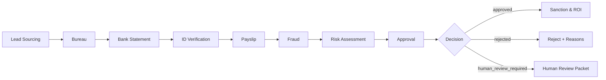

# ABCD Hackathon — Loan Application Multi-Agent Workflow

A **multi-agent workflow** that simulates an end-to-end loan underwriting “hello pipeline” using a **LangGraph state machine** + specialized agents. The system turns messy application inputs into **structured, auditable decisions**: `approve / reject / human_review_required`, with masked logging and checkpointed traces.

## Why Multi-Agent (Track Fit)
Track: **Multi-Agent Systems & Workflows** — systems where multiple agents collaborate to solve real-world problems
that are unreliable for a single agent, with purposeful coordination (handoffs, verification, consensus).

Single-agent “do everything” prompts are fragile: they miss fields, contradict themselves, and are hard to debug.
This repo splits the journey into **specialist agents** and coordinates them through a **deterministic workflow**:
- **Handoffs** between agents with a shared typed state
- **Validation** via Pydantic schemas + strict JSON
- **Policy/threshold driven** human escalation
- **Checkpointed traceability** (node-wise inputs/outputs)

## Measurable Gain
Traditional loan journeys with human intervention take **~2–3 hours** end-to-end.  
With this multi-agent architecture (even with human review), **time drops to ~10 minutes**, a **~95% reduction**,
while reducing human error and enforcing consistent, auditable decisions.

## Flow Diagram


## What It Does (Pipeline)
The LangGraph workflow runs these nodes in order:

1. **Lead Sourcing** — normalize lead/application payload
2. **Bureau** — synthesize/interpret credit bureau signals
3. **Bank Statement** — parse & extract income/cashflow indicators
4. **ID Verification** — document + selfie / identity checks (structured)
5. **Payslip** — salary verification + stability checks
6. **Fraud** — rule + LLM-based suspiciousness grading
7. **Risk Assessment** — consolidate risk signals into score/bands
8. **Approval** — final decision + reasons + `human_review_required` triggers

## Key Features
- **Typed shared state**: `app/state.py` defines a single source of truth for all agent outputs
- **Config-driven behavior**:
  - `configs/models.yaml` per-agent model/temperature
  - `configs/thresholds.yaml`, `configs/policy.yaml`, `configs/roi.yaml`, `configs/suspicious_keywords.yaml`
- **Prompt templates** in `prompts/*.yaml` (agent-specific + common fragments)
- **Strict JSON & Pydantic** validation for robustness
- **Masking** of sensitive identifiers (PAN, Aadhaar-like patterns) in logs (`app/utils/masking.py`)
- **Run logging & trace** with `run_id`, node-wise events, and optional checkpoint DB

## Repo Structure
- `app/`
  - `graph.py` — LangGraph workflow (nodes + edges)
  - `state.py` — Pydantic schemas for state + sections
  - `llm_runner.py` — OpenAI call wrapper + JSON extraction
  - `prompt_loader.py`, `config.py` — load YAML prompts/config
  - `logging_setup.py`, `reporting.py` — structured logs + summaries
  - `checkpoint_utils.py` — SQLite checkpoint helpers
- `agents/` — one module per agent (lead, bureau, bank, id, payslip, fraud, risk, approval)
- `prompts/` — YAML prompts for each agent
- `configs/` — model + policy + thresholds
- `data/` — sample inputs for quick testing

## Quickstart

### 1) Install
```bash
python -m venv .venv python=3.10
source .venv/bin/activate  # (Windows) .venv\Scripts\activate
pip install -r requirements.txt

## Deployment

The project is deployed and publicly accessible on **Streamlit**:

👉 **[ABCD – Any Body Can Disburse](https://abcd-agent-hackathon.streamlit.app/)**

You can run the live app and observe the full multi-agent decision workflow end-to-end.

---

## About the Authors

### **Arpit Upadhyay**
- **Role:** Data Scientist, Piramal Finance  
- **Education:** B.Tech in Mechanical Engineering, IIT Bombay (Class of 2024)  
- **Interests:** Data Science, Reinforcement Learning, Agentic AI  

---

### **Parag Bajaj**
- **Role:** Senior GenAI Solutions Architect, Piramal Finance  
- **Education:** B.Tech in Mechanical Engineering, IIT Bombay (Class of 2023)  
- **Interests:** Generative AI, Machine Learning, Cloud Security  

---

### **Ayushmaan Pandey**
- **Role:** Data Scientist, Piramal Finance  
- **Education:** B.Tech in Electrical Engineering, IIT Delhi (Class of 2025)  
- **Interests:** Data Science, Finance, Rust  

